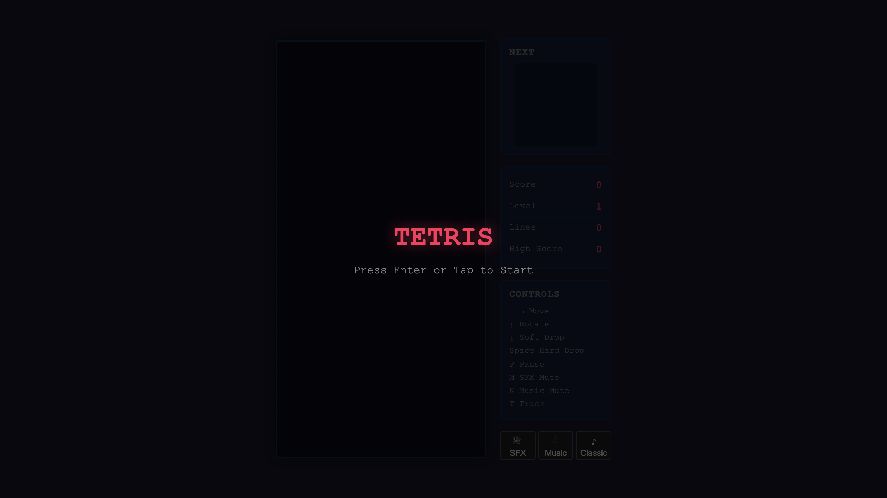

# Tetris

A classic Tetris game built entirely in the browser with pure HTML, CSS, and JavaScript.




## Features

- Classic Tetris gameplay with 7 tetromino types (I, O, T, S, Z, J, L)
- 7-bag randomizer for fair piece distribution
- SRS (Super Rotation System) wall kicks
- Ghost piece preview showing drop position
- Next piece preview
- Progressive difficulty with level system
- Line clear flash animation
- High score persistence (localStorage)
- Responsive design with mobile touch controls

## How to Play

Open `index.html` in any modern browser.

### Keyboard Controls

| Key | Action |
|-----|--------|
| ← → | Move piece left/right |
| ↑ | Rotate clockwise |
| ↓ | Soft drop (1 point per cell) |
| Space | Hard drop (2 points per cell) |
| P | Pause/unpause |
| Enter | Start game / restart after game over |

### Touch Controls (Mobile)

- Swipe left/right: Move piece
- Swipe down: Soft drop
- Swipe up: Hard drop
- Tap: Rotate
- Touch buttons at bottom: ◀ ▼ ↻ ▶ ⬇

### Scoring

- 1 line: 100 × level
- 2 lines: 300 × level
- 3 lines: 500 × level
- 4 lines (Tetris): 800 × level

Level increases every 10 lines cleared, speeding up the drop rate.

## Project Structure

```
tetris/
├── index.html          # Main HTML entry point
├── CLAUDE.md           # Architecture documentation
├── README.md           # This file
├── screenshot.png      # Game screenshot
├── js/
│   ├── game.js         # Core scaffolding (event bus, state, game loop)
│   ├── engine.js       # Game logic module
│   ├── renderer.js     # Canvas rendering module
│   └── ui.js           # Input handling & UI module
└── css/
    ├── base.css        # Base styles & layout
    ├── board.css       # Board canvas styling
    └── ui.css          # Side panel, overlays, touch controls
```

## Built with Claude Code Agent Teams

This game was built using Claude Code's experimental agent teams feature, which allows multiple AI agents to work in parallel on different parts of a codebase.

### Session Details

- **Model**: Claude Opus 4.6
- **Team Name**: `tetris`

### The Original Plan

The project was designed to split cleanly across 3 teammates with no file conflicts. A shared game state and event bus were scaffolded beforehand so the 3 modules could stay decoupled.

**Scaffolded shared code** (`js/game.js`) provided:
- Tetromino definitions (shapes, rotation matrices, colors)
- Constants (COLS=10, ROWS=20, CELL_SIZE=30)
- Game state object (`window.gameState`)
- Event bus (`window.events`) for inter-module communication
- Main game loop calling `update()` and `draw()` on each module

### Team Structure

Three teammates worked in parallel, each with exclusive ownership of specific files:

| Teammate | Module | Responsibility | Files |
|----------|--------|---------------|-------|
| **engine** | `engine.js` | Game logic: piece spawning, movement, rotation with SRS wall kicks, collision detection, line clearing, gravity, scoring, game over | `js/engine.js` |
| **renderer** | `renderer.js` + `board.css` | Canvas drawing: 10×20 grid, current piece, ghost piece, locked blocks with colors, line clear flash animation | `js/renderer.js`, `css/board.css` |
| **ui** | `ui.js` + `ui.css` | Input handling: keyboard + touch controls, score/level/lines panel, next piece preview, start/pause/game-over screens, high score persistence | `js/ui.js`, `css/ui.css` |

### How Modules Communicate

All modules communicate exclusively through an event bus (`window.events`). No direct module imports or function calls between modules.

**Input Events** (emitted by ui.js):
- `input-left`, `input-right`, `input-down`, `input-rotate`, `input-drop`, `input-pause`, `input-start`, `request-restart`

**Game Events** (emitted by engine.js):
- `piece-locked`, `piece-moved`, `lines-cleared`, `score-changed`, `level-up`, `game-over`, `game-start`, `game-pause`, `hard-drop`

### The Prompt Used to Spawn the Team

```
Create an agent team with 3 teammates to build this Tetris game:

- "engine" teammate: implement the game logic in js/engine.js — piece spawning,
  movement, rotation with wall kicks, collision detection, line clearing, gravity,
  game over. Only edit js/engine.js.

- "renderer" teammate: implement canvas rendering in js/renderer.js and css/board.css —
  draw the 10x20 grid, current piece, ghost piece, locked blocks with colors,
  line clear animation. Only edit js/renderer.js and css/board.css.

- "ui" teammate: implement controls and UI in js/ui.js and css/ui.css — keyboard
  input (arrows + space + P), score/level/lines panel, next piece preview,
  start/pause/game-over screens, high score in localStorage, touch controls.
  Only edit js/ui.js and css/ui.css.

Read CLAUDE.md for the full spec. Each teammate must ONLY edit their own files.
Require plan approval before they make changes.
```

### Teammate Spawn Prompts

Each teammate received a detailed prompt specifying their responsibilities:

<details>
<summary><strong>Engine Teammate Prompt</strong></summary>

```
You are the "engine" teammate on the tetris team. Your job is to implement the complete Tetris game engine.

First, read /Users/caiguanhao/work/test/tetris/CLAUDE.md for the full spec.
Then read /Users/caiguanhao/work/test/tetris/js/game.js to understand the shared state, constants, tetromino definitions, and event bus.
Then read /Users/caiguanhao/work/test/tetris/js/engine.js to see the placeholder.

Check your assigned task with TaskList and TaskGet for full details.

Implement the complete game engine in js/engine.js:
- Piece spawning with 7-bag randomizer, spawn at top center
- Movement (left, right, soft drop) via input events
- Rotation with SRS wall kicks
- Collision detection
- Lock piece to board
- Line clearing with scoring
- Gravity (auto-drop based on dropInterval)
- Level system (level up every 10 lines)
- Game over detection
- Hard drop
- Handle start, pause, restart

You MUST ONLY edit /Users/caiguanhao/work/test/tetris/js/engine.js. Do not touch any other file.
```

</details>

<details>
<summary><strong>Renderer Teammate Prompt</strong></summary>

```
You are the "renderer" teammate on the tetris team. Your job is to implement the canvas renderer for the Tetris game.

First, read /Users/caiguanhao/work/test/tetris/CLAUDE.md for the full spec.
Then read /Users/caiguanhao/work/test/tetris/js/game.js to understand the shared state, constants, and tetromino definitions.
Then read /Users/caiguanhao/work/test/tetris/js/renderer.js to see the placeholder.
Then read /Users/caiguanhao/work/test/tetris/index.html to see the canvas elements.

Check your assigned task with TaskList and TaskGet for full details.

Implement the complete renderer in js/renderer.js and css/board.css:
- Initialize canvas 2D context from the #board canvas (300x600)
- Draw the 10x20 grid with subtle grid lines
- Draw locked blocks from gameState.board with their colors
- Draw the current piece at its position
- Draw a ghost piece (translucent) showing where current piece will land
- Line clear flash animation (listen to 'lines-cleared' event, briefly flash rows white)
- Clear and redraw every frame

You MUST ONLY edit /Users/caiguanhao/work/test/tetris/js/renderer.js and /Users/caiguanhao/work/test/tetris/css/board.css. Do not touch any other file.
```

</details>

<details>
<summary><strong>UI Teammate Prompt</strong></summary>

```
You are the "ui" teammate on the tetris team. Your job is to implement the input handling, UI panels, and overlay screens for the Tetris game.

First, read /Users/caiguanhao/work/test/tetris/CLAUDE.md for the full spec.
Then read /Users/caiguanhao/work/test/tetris/js/game.js to understand the shared state, constants, and event bus.
Then read /Users/caiguanhao/work/test/tetris/js/ui.js to see the placeholder.
Then read /Users/caiguanhao/work/test/tetris/index.html to see the DOM structure.
Then read /Users/caiguanhao/work/test/tetris/css/base.css to see existing layout styles.

Check your assigned task with TaskList and TaskGet for full details.

Implement the complete UI in js/ui.js and css/ui.css:
- Keyboard input: ArrowLeft/Right/Down for movement, ArrowUp for rotate, Space for hard drop, P for pause, Enter for start/restart
- Touch controls: swipe gestures + touch-friendly buttons for mobile
- Update score/level/lines/high-score displays from gameState
- Draw next piece preview on #next-piece canvas (120x120)
- Manage overlay screens: start screen visible initially, pause overlay, game over screen with final score
- High score persistence via localStorage
- Style everything in css/ui.css

You MUST ONLY edit /Users/caiguanhao/work/test/tetris/js/ui.js and /Users/caiguanhao/work/test/tetris/css/ui.css. Do not touch any other file.
```

</details>

### Coordination Flow

1. **Scaffolding**: The team lead created all 9 scaffold files before spawning teammates
2. **Team creation**: `TeamCreate` with 3 parallel agents
3. **Task creation**: 3 tasks via `TaskCreate` with detailed descriptions
4. **Parallel spawning**: All 3 teammates spawned simultaneously with `run_in_background: true`
5. **Task assignment**: Each task assigned to its respective teammate
6. **Completion tracking**: Team lead monitored via `TaskList` and teammate messages
7. **Shutdown**: Graceful shutdown requests sent to all teammates
8. **Cleanup**: `TeamDelete` to remove team and task directories

The renderer and UI teammates finished in ~9 minutes. The engine teammate took ~17 minutes due to the complexity of implementing SRS wall kicks and the 7-bag randomizer.
